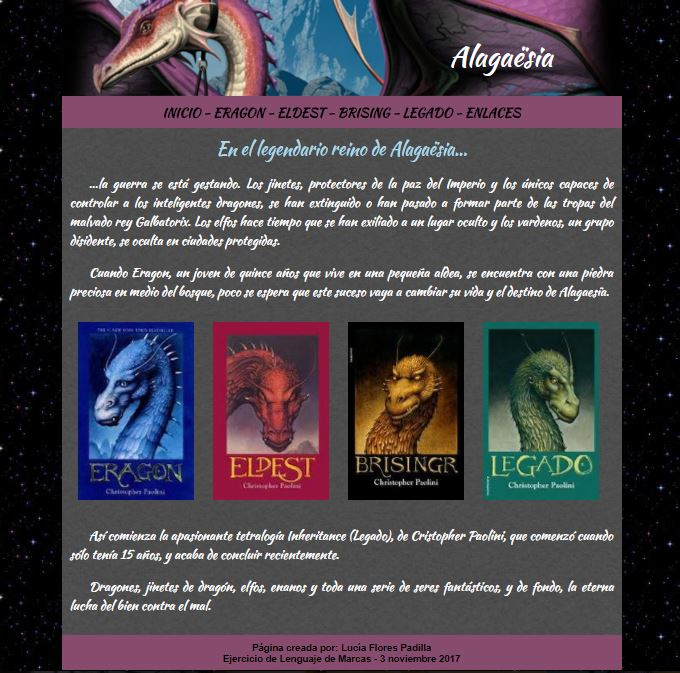

# Ejercicios y Trabajos de HTML

Ejercicios y trabajos de la asignatura de **Lenguaje de Marcas** de **1º de DAW
(Desarrollo de Aplicaciones Web)** en el IES Campanillas.

## A continuación se muestrar imágenes de los Ejercicios:

 * Ejercicio Otoño con tile :fallen_leaf:  
 

 * Otro Ejercicio Otoño sin tile :maple_leaf:  
 

 * Ejercicio LLuvia con tile :cloud:  
 
 

 * Ejercicio LLuvia con imagen de fondo :umbrella:  
 

 * Ejercicio prueba Halloween Clase :jack_o_lantern:  
 

 * Trabajo Halloween :sos:  
 

 * Examen Alagaësia   
 

 * Examen Realidad Aumentada   
 

 * Ejercicio Tortilla de patatas   
 

 * Examen Diseño Floral   
 

 * Examen Málaga, una ciudad con arte   
 

 * Carrousel 3D giratorio   
 

 * Examen Islas Canarias   
 

 * Examen programación y robotica educativa   
 

 * Examen Aventura natural   
 

